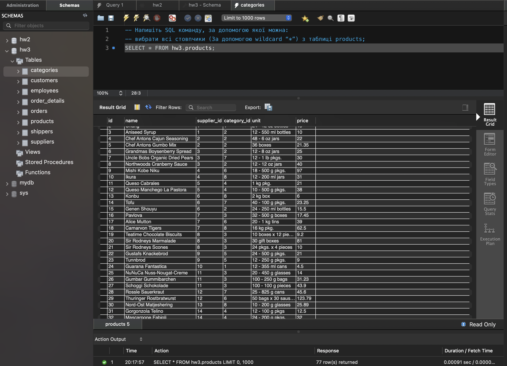
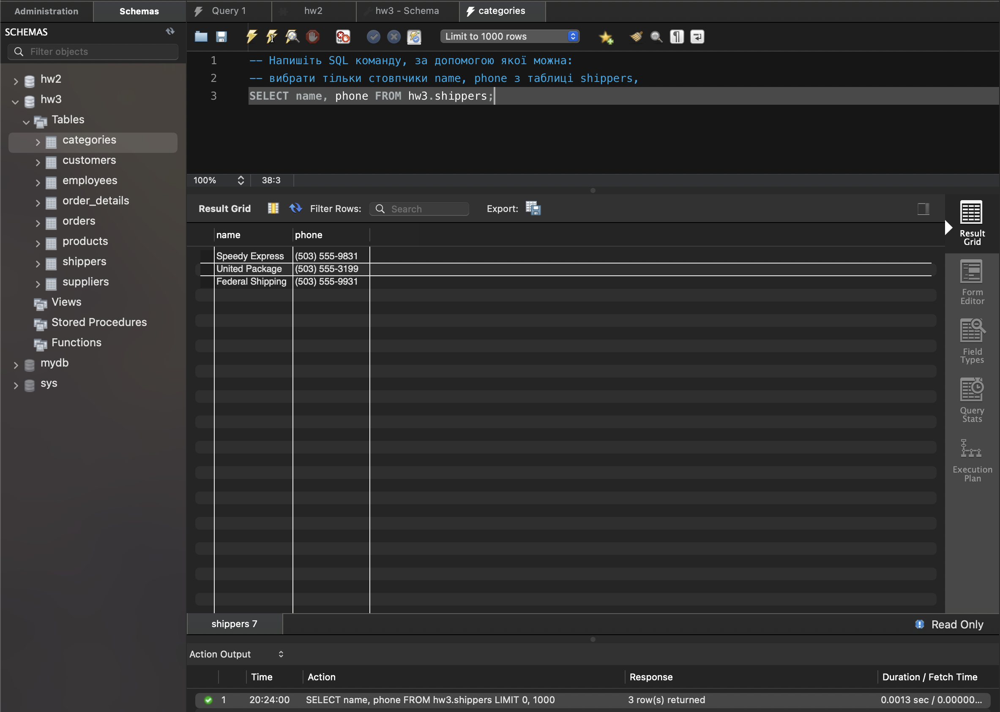
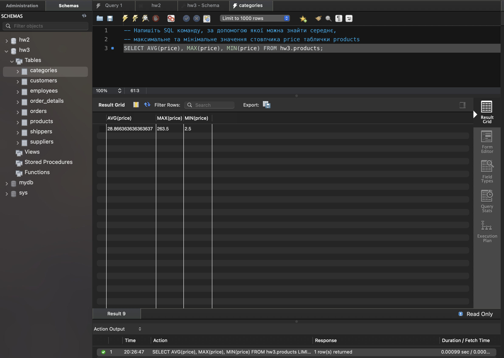
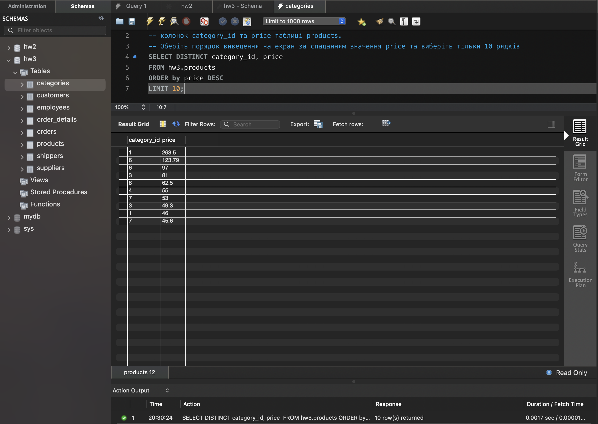
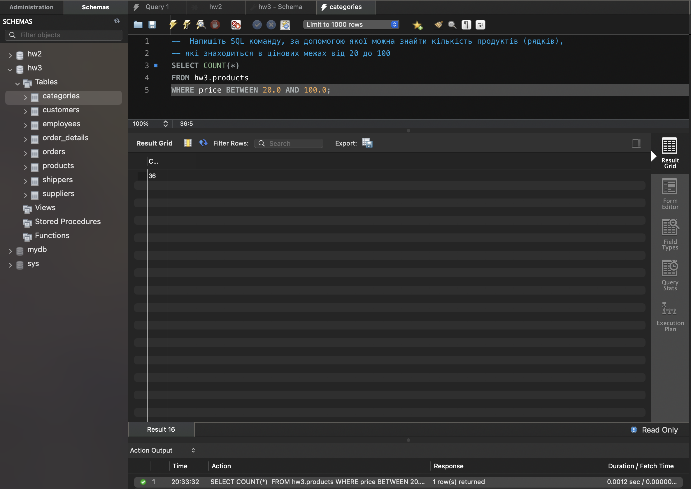
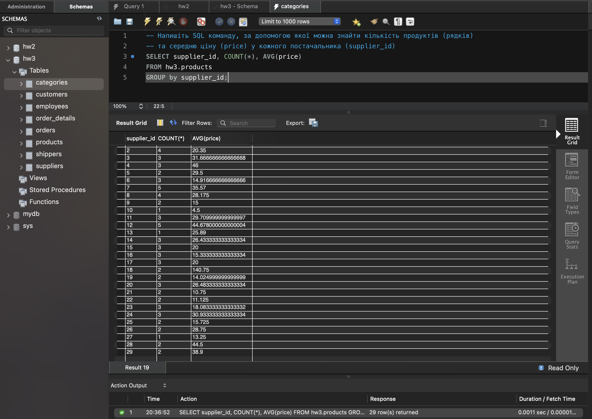

# goit-rdb-hw-03

Author: M.Podopryhora

## Task 1.1

Напишіть SQL команду, за допомогою якої можна вибрати всі стовпчики (За
допомогою wildcard "\*") з таблиці products:

```
SELECT *
FROM hw3.products;
```



## Task 1.2

Напишіть SQL команду, за допомогою якої можна вибрати тільки стовпчики name,
phone з таблиці shippers:

```
SELECT name, phone
FROM hw3.shippers;
```



## Task 2

Напишіть SQL команду, за допомогою якої можна знайти середнє, максимальне та
мінімальне значення стовпчика price таблички products:

```
SELECT AVG(price), MAX(price), MIN(price)
FROM hw3.products;
```



## Task 3

Напишіть SQL команду, за допомогою якої можна обрати унікальні значення колонок
category_id та price таблиці products.

Оберіть порядок виведення на екран за спаданням значення price та виберіть
тільки 10 рядків:

```
SELECT DISTINCT category_id, price
FROM hw3.products
ORDER by price DESC
LIMIT 10;
```



## Task 4

Напишіть SQL команду, за допомогою якої можна знайти кількість продуктів
(рядків), які знаходиться в цінових межах від 20 до 100:

```
SELECT COUNT(*)
FROM hw3.products
WHERE price BETWEEN 20.0 AND 100.0;
```



## Task 5

Напишіть SQL команду, за допомогою якої можна знайти кількість продуктів
(рядків) та середню ціну (price) у кожного постачальника (supplier_id):

```
SELECT supplier_id, COUNT(*), AVG(price)
FROM hw3.products
GROUP by supplier_id;
```


